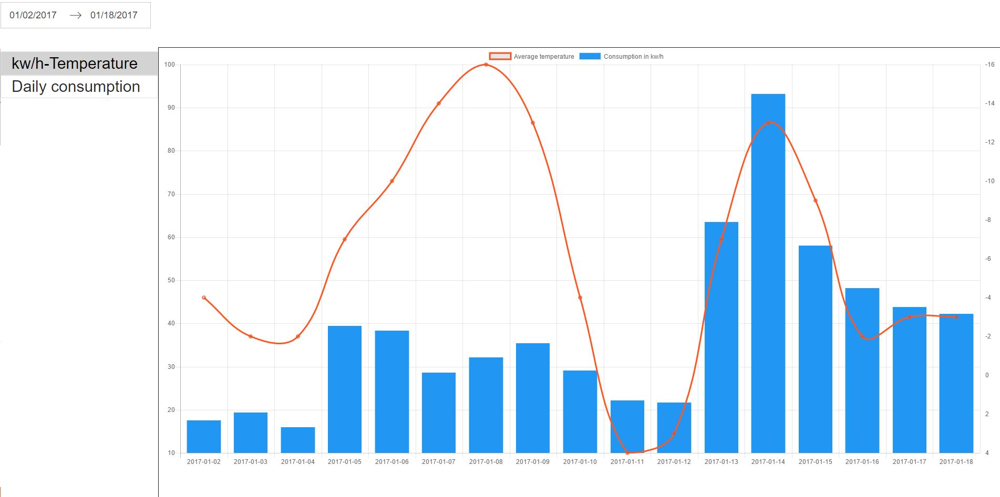

# Hydra



Hydro Quebec has installed network-connected meters and provides on its website a log of the records.   
As a data-lover, chart fanatic engineer, although excited for the availability of such data,
I would like to see more elaborated, easy-to-read, exciting data visualization.

I don't own this data, I have made my best effort to determin the legality of this project
but ultimately I haven't been able to find more. Therefore the following remains what I just 
said: **a fun project**. Use it as such.

## How did I make it work
To avoid redirects I have decided to let NODE make the following request to the original site.
This could perhaps be avoided with a frame or by cancelling the redirect but I decided for this
easy (perhaps temporary) solution. As such HydroQuebec credentials will need to be passed over
the wire which does not excite me a lot. At this point everything is running locally so I am
not too concerned, but in the near future I may need to implement SSL-encryption to protect them.

## What I'd like to see
HydroQuebec doesn't seem to have in place triggers that notify users of outages in area of 
interest. Perhaps this could be offered with the assistante of Twilio.

## Authenticating
To login make a `POST` request to:   
`https://www.hydroquebec.com/portail/web/clientele/authentification?p_auth=EbW90P8A&p_p_id=58&p_p_lifecycle=1&p_p_state=maximized&_58_struts_action=/login/login&_58_action=login`  

with body:

```js
{
   login: username
  _58_password: password  
}
```
Logging in returns a bunch of cookies but only the two with key `JSESSIONID` matter.
 Attach those cookies to any subsequent request.

## Retrieving Data

After having logged-in we have the cookies necessary to get the data. Before making the 
actual request to retrieve the data we need to
do a `GET` request at the page:   
```https://www.hydroquebec.com/portail/fr/group/clientele/portrait-de-consommation```   

Set header `content-type` to `"application/x-www-form-urlencoded"` and on success (TODO: 
define what success looks like) make one the following request.


To get a **summary** of your data make `GET` request to:  
`https://www.hydroquebec.com/portail/fr/group/clientele/portrait-de-consommation?p_p_id=portraitConsommation_WAR_lswrb_INSTANCE_G4WcPdIy6LKl&p_p_lifecycle=2&p_p_resource_id=resourceObtenirDonneesPeriodesConsommation`  
- All the params in the URL are mandatory
- A JSON object is expected as return

To get **details** of your data make a `GET` request to   
`https://www.hydroquebec.com/portail/fr/group/clientele/portrait-de-consommation?p_p_id=portraitConsommation_WAR_lswrb_INSTANCE_G4WcPdIy6LKl&p_p_lifecycle=2&p_p_resource_id=resourceObtenirDonneesQuotidiennesConsommation&dateDebutPeriode=yyyy-mm-dd&dateFinPeriode=yyyy-mm-dd`
-  `dateDebutPeriode` and `dateFinPeriode` work as expected
- All the params in the URL are mandatory
- A JSON object is expected as return

## Logging out
To logout make GET request to:   
`https://www.hydroquebec.com/portail/fr/c/portal/logout`
   
## Experimental   
**To further test**   
`http://poweroutages.hydroquebec.com/pannes/donnees/v3_0/bismarkers{yyyymmddhhmmss}.json`

- Replace `{yyyymmddhhmmss}` with the time of the report
- The `JSON` data structure returned is obfuscated. An array of `pannes` contains the outages   

**Example of an outage**
```json
[
    2, 
    "2016-12-17 13:00:21", 
    "2017-01-31 00:15:00",
    "P", 
    "[-61.64773372602691, 47.56419005411159]", 
    "A", 
    "5",
    "58",
    "2510",
     ""
]
```

**Outage JSON item example**   
0. number of people affected
1. outage start date
2. outage end date
3. type (e.g.`p` if is outage)
4. coordinates
5. status
6: ??
7. cause
8. municipalityID
9. idMessage

**Cause code**   
11:"Cause: Equipment failure"  
12:"Cause: Equipment failure"  
13:"Cause: Equipment failure"  
14:"Cause: Equipment failure"  
15:"Cause: Equipment failure"  
21:"Cause: Weather"  
22:"Cause: Weather"  
24:"Cause: Weather"  
25:"Cause: Weather"  
26:"Cause: Weather"  
31:"Cause: Accident or incident"  
32:"Cause: Accident or incident"  
33:"Cause: Accident or incident"  
34:"Cause: Accident or incident"  
41:"Cause: Accident or incident"  
42:"Cause: Accident or incident"  
43:"Cause: Accident or incident"  
44:"Cause: Accident or incident"  
51:"Cause: Damages due to vegetation"  
52:"Cause: Damages due to an animal"  
53:"Cause: Damages due to an animal"  
54:"Cause: Accident or incident"  
55:"Cause: Accident or incident"  
56:"Cause: Accident or incident"  
57:"Cause: Accident or incident"  
58:"Cause: Equipment failure"  
70:"Cause: Equipment failure"   
72:"Cause: Equipment failure"  
73:"Cause: Equipment failure"   
74:"Cause: Equipment failure"   
79:"Cause: Equipment failure"  
defaut:"Cause: Equipment failure"  

**Status code**   

A: "Status: Work assigned"   
L: "Status: Crew at work"  
R: "Status: Crew on its way"  
default: ""
